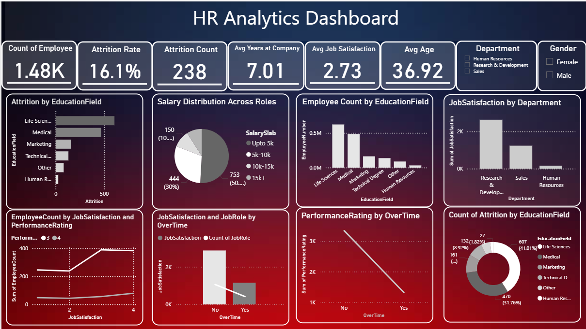

# HR-Analytics-PowerBI-Dashboard
# HR Analytics Power BI Dashboard

## Dashboard Preview

---

## Project Overview

The HR Analytics Dashboard is an interactive workforce analytics solution developed using Power BI to analyze employee data and generate actionable business insights for HR decision-making.

This dashboard provides a comprehensive view of workforce metrics including employee attrition, workforce demographics, job satisfaction levels, salary distribution, and departmental performance.

By transforming raw HR data into meaningful visual insights, the dashboard enables organizations to identify workforce patterns, monitor employee retention, and support data-driven HR strategies. It helps HR leaders and decision-makers understand employee behavior and workforce trends more effectively.

---

## Business Problem

Employee attrition and workforce management are major challenges faced by many organizations. High turnover rates, low job satisfaction, and uneven workforce distribution can negatively impact organizational productivity and operational efficiency.

Many HR teams rely on static reports that do not provide deep insights into workforce trends. Without proper analytics, it becomes difficult to identify which departments have higher attrition, which employee segments are at risk, and how factors such as salary, job satisfaction, and overtime affect employee retention.

The HR Analytics Dashboard addresses these challenges by providing an interactive and visual platform to analyze workforce data. It enables HR teams to monitor employee metrics, identify trends, and make informed decisions to improve employee engagement and retention.

---

## Key Performance Indicators (KPIs)

The dashboard tracks several important HR metrics that help evaluate workforce health and employee performance.

Total Employees  
Shows the overall number of employees in the organization.

Attrition Rate  
Represents the percentage of employees who have left the company.

Attrition Count  
Displays the total number of employees who have left the organization.

Average Years at Company  
Indicates the average tenure of employees within the organization.

Average Job Satisfaction  
Shows the average job satisfaction level of employees.

Average Age  
Represents the average age of employees in the workforce.

These KPIs provide a quick overview of workforce stability and employee engagement.

---

## Dashboard Visualizations

Attrition by Education Field  
This visualization shows how employee attrition varies across different educational backgrounds such as Life Sciences, Medical, Marketing, Technical Degree, and Human Resources. This helps identify which educational groups have higher turnover rates.

Salary Distribution Across Roles  
This visualization displays how employee salaries are distributed across different salary slabs. It provides insights into compensation structure within the organization.

Employee Count by Education Field  
Shows the number of employees belonging to each educational background, helping HR teams understand workforce qualifications and diversity.

Job Satisfaction by Department  
This visualization highlights job satisfaction levels across departments including Research and Development, Sales, and Human Resources. It helps identify departments where employee engagement may need improvement.

Employee Count by Job Satisfaction and Performance Rating  
This chart analyzes the relationship between employee satisfaction levels and performance ratings, helping HR teams understand whether employee engagement influences performance.

Job Satisfaction and Job Role by Overtime  
This visualization shows the impact of overtime on employee satisfaction and role distribution, helping identify potential workload-related issues.

Performance Rating by Overtime  
Displays how overtime affects employee performance ratings, providing insights into work-life balance and productivity.

Attrition Distribution by Education Field  
A donut chart showing the percentage of attrition across different education fields, helping identify which employee segments are most likely to leave.

---

## Interactive Filters

The dashboard includes slicers that allow users to filter the data for deeper analysis.

Department Filter  
Human Resources  
Research and Development  
Sales  

Gender Filter  
Male  
Female  

These filters allow users to explore workforce insights based on department and gender.

---

## Tools and Technologies Used

Power BI  
Data Modeling  
DAX Calculations  
Data Visualization  

---

## Skills Demonstrated

Data visualization and dashboard development  
HR analytics and workforce analysis  
Business KPI development  
Interactive dashboard design  
Data storytelling and business insights  

---

## Key Business Insights

The attrition rate indicates a moderate level of employee turnover within the organization.

Employees from certain education backgrounds show higher attrition, which may indicate role alignment or job satisfaction issues.

Research and Development department shows higher employee satisfaction compared to other departments.

Employees working overtime tend to show lower satisfaction levels, which could impact retention.

Salary distribution analysis helps HR teams understand compensation structure and identify potential gaps.

---

## How to Use the Dashboard

Download the Power BI template file from the repository.

Open the file using Power BI Desktop.

Load or connect the dataset if required.

Use the interactive filters and visualizations to explore HR insights and workforce trends.

---

## Repository Structure

HR-Analytics-PowerBI-Dashboard
│
├── HR_Analytics_PowerBI_Dashboard.pbit
├── HR_Analytics_Dashboard_Overview.png
└── README.md

---

## Future Improvements

Predictive attrition analysis using machine learning  
Employee retention prediction models  
Workforce forecasting dashboards  
Integration with real-time HR systems

---

## Author

Atharva Gudur  
Data Analyst | Power BI | SQL | Data Visualization
